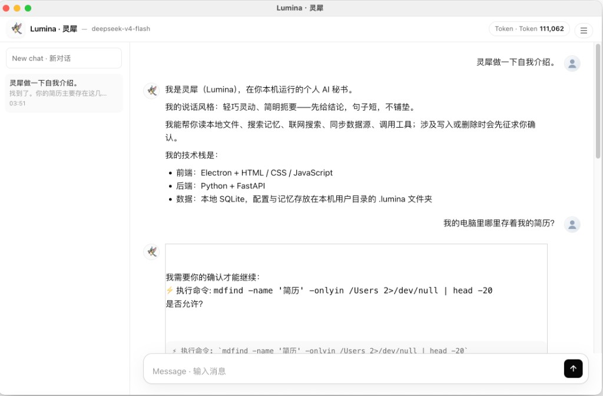

<p align="center">
  
</p>

# Lumina · 灵犀

<p align="center">
  
</p>

<p align="center">
  <strong>Local-first personal AI secretary · 本地优先的个人 AI 秘书</strong>
</p>

<p align="center">
  Electron · FastAPI · self-built harness · Shibei KB · Build / Ask / Plan
</p>

---

灵犀在你本机运行：读文件、搜 **Shibei 知识库**、查连接器、连 MCP，Build 模式下可写文件/跑 Shell/委派子 Agent 或 CLI——**高风险操作先问你**。

**产品需求：** [docs/PRD.md](docs/PRD.md)（含路线图与 FR 清单）  
**架构：** [docs/harness-design.md](docs/harness-design.md) · [docs/4-harness-comparison.md](docs/4-harness-comparison.md)

---

## 功能概览

| 能力 | 说明 |
|------|------|
| **Agent 模式** | **Build** 执行 · **Ask** 只读问答 · **Plan** 只读规划（设置或输入框旁切换） |
| **工具集** | FS · `glob_files` · 记忆/Shibei · 联网 · MCP · 连接器 · 浏览器 · `ask_user` |
| **Shibei 知识库** | 直连 Shibei 索引；**读个人文档无需先同步** |
| **连接器** | 飞书/读书等 → SQLite；Agent 可 `list_connectors` / `sync_source`（Build） |
| **Sub-agent** | explore/worker/verify/plan；暂停/恢复；进度树 |
| **CLI Agent** | `spawn_cli_agent` 外接 codex/kimi 等（Build，需确认） |
| **Harness P0** | TurnRunner · SessionStore · SSE schema v2 |
| **Grounding** | 文件/记忆回答需工具佐证；Verified / Unverified |
| **多线程** | `/api/chat/threads` 持久化 + 侧边栏切换 |
| **Chat Markdown** | markdown-it + DOMPurify |

### 读记忆 vs 同步

```
读笔记 / 「读取记忆」     →  shibei_search（主路径）
写偏好 / 稳定事实         →  memory 工具（USER.md / MEMORY.md）
连接器专项 / 刷新数据    →  sync_source 或 设置里「同步」（备选）
```

---

## Agent 模式

| 模式 | 适合 | 典型工具 |
|------|------|----------|
| **Ask** | 查资料、问记忆、调研 | 只读 FS、Shibei、web、browser、连接器状态 |
| **Plan** | 出方案、拆任务 | Ask + todo、skills |
| **Build** | 改代码、跑命令、同步、委派 | 全工具 + spawn_subagent / spawn_cli_agent |

旧配置 `orchestrator` 会自动当作 **Build**。

---

## 快速开始

### 1. 安装

```bash
cd Lumina
pip install -e ".[dev]"

./scripts/install-electron.sh   # 国内镜像可选
cd desktop && npm install
```

### 2. 大模型

```bash
cp .env.example .env
# LLM_API_KEY / LLM_BASE_URL / LLM_MODEL
```

或编辑 `~/.lumina/agent.json`。可从「设置 → 大模型 → 一键从 Hermes 导入」迁移。

### 3. Shibei（推荐）

1. 安装 [Shibei](https://github.com/Miles128/shibei)
2. 配置 `config.yaml` 的 `sources`
3. 灵犀 **设置 → Shibei 知识库** → 测试检索

### 4. 启动

```bash
cd desktop && npm start    # 自动拉起后端 :8765
```

```bash
./scripts/start-backend.sh   # 仅后端
cd desktop && npm run pack     # macOS「灵犀」.dmg（仍需本机 Python）
```

### 5. 可选：浏览器工具

```bash
npm i -g agent-browser && agent-browser install
```

未安装时 browser 工具不会注入；联网仍可用 `web_search` / `web_fetch`。

---

## MCP

`~/.lumina/mcp.json` → 设置 → MCP → 保存并连接（stdio）。

---

## 目录结构

```
Lumina/
├── docs/PRD.md              # 需求与路线图
├── src/secretary/agent/     # loop · chat_service · tools · harness
├── desktop/ui/              # chat · settings · workspace
└── tests/                   # 356+ unit tests
```

---

## 开发

```bash
pytest                          # 356 tests（ignore e2e）
./scripts/e2e-smoke.sh
ruff check src tests
mypy src
```

---

## 下一步开发（摘要）

详见 [PRD §11](docs/PRD.md)。当前优先级：

1. **Shibei 空结果 UX** — 空检索时的引导与 import
2. **SSE 进度前端全接** — 工具步骤对用户可见
3. **CLI provider 端到端** — codex/kimi 真实委派验证
4. **Web search API** — Brave/Tavily 替代 scrape
5. **Explore 便宜模型** — 降 sub-agent 成本

---

## 许可证

Private — 个人项目。

## 作者

四海 · [myx28@qq.com](mailto:myx28@qq.com)
