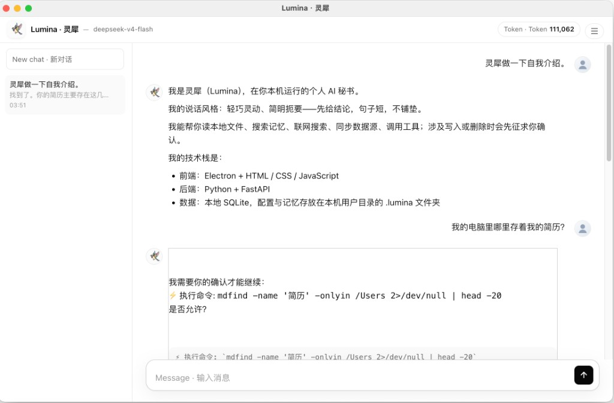

<p align="center">
  
</p>

# Lumina · 灵犀

<p align="center">
  
</p>

<p align="center">
  <strong>Local-first Agent productivity tool · 本地优先的通用 Agent 生产力工具</strong>
</p>

<p align="center">
  Electron · FastAPI · self-built harness · conversation map · workflows · Build / Ask / Plan / Auto
</p>

---

灵犀在你本机运行：自研 harness 驱动工具调用——读文件、跑 Shell、连 **标准 MCP**、可选 Shibei；Build 模式下可写文件 / 委派子 Agent——**高风险操作先问你**。

外部集成只走 **MCP**（stdio / SSE / Streamable HTTP）或 **CLI**（`shell` / MCP 包装的命令行），不为各平台维护专用连接器产品面。

当前差异点：**对话地图**（分支 / 回滚 / 恢复）、**Skill 工作流画布**（MVP）、**思考链轨迹**、可调本地 harness。  
进行中：**WriteGate / 受控深树 / Mission Strip**（[规格](docs/superpowers/specs/2026-07-30-controlled-tree-adversarial-mission-strip-design.md)）。

**产品需求：** [docs/PRD.md](docs/PRD.md)（含路线图与 FR 清单）  
**文档索引：** [docs/README.md](docs/README.md)  
**架构：** [docs/harness-design.md](docs/harness-design.md) · [docs/4-harness-comparison.md](docs/4-harness-comparison.md)

---

## 功能概览

| 能力 | 说明 |
|------|------|
| **Agent 模式** | **Build** 执行 · **Ask** 只读问答 · **Plan** 只读规划 · **Auto** 自动路由（设置或输入框旁切换） |
| **Harness** | TurnRunner · SessionStore · SSE · confirm · compaction · Auto profile · **可调参**（FR-52） |
| **工具集** | FS · `glob_files` · 记忆/Shibei · 联网 · MCP · shell/CLI · 浏览器 · `ask_user` |
| **对话地图** | 节点化分支、fork / rollback / restore、紧凑节点视图 |
| **Sub-agent** | explore / worker / verify / plan；暂停/恢复；进度树 |
| **Skill 工作流** | Drawflow 画布 · 列表运行 · HumanReview / confirm_before · 演示模板（F26 MVP） |
| **思考链轨迹** | 记录 / 导出 / 回放 turn 轨迹（FR-51 MVP） |
| **知识库（可选）** | Shibei 直连 + workspace；启用时读文档优先检索 |
| **知识工作路由** | Auto 识别调研 / 写作 / 办公意图，注入对应检索与格式约束 |
| **联网调研** | `web_search` + `web_fetch`；回答带脚注引用，文末列 **域名/简短路径 + 网站 favicon** |
| **外部集成** | 标准 MCP 或 CLI；遗留 Sync/平台连接器冻结、不再扩展 |
| **Grounding** | 文件/记忆回答需工具佐证；Verified / Unverified |
| **多线程** | `/api/chat/threads` 持久化 + 侧边栏；标题跟随最新提问 |
| **Chat Markdown** | markdown-it + DOMPurify |

### 联网引用格式

调研类回答在正文用脚注编号（如 `[^1]`），文末逐条列出来源，每条带网站图标：

```
[^1]:  github.com/trending
```

不写完整 `https://` 长链接；Agent 会自行检索并总结，不会只贴链接让用户自己去看。

### 读记忆（可选路径）

```
读笔记 / 「读取记忆」     →  shibei_search（启用 Shibei 时的主路径）
写偏好 / 稳定事实         →  memory 工具（画像 / MEMORY.md）
外部数据 / SaaS           →  用户自备 MCP 或 CLI（不再新增平台专用 connector）
```

---

## Agent 模式

| 模式 | 适合 | 典型工具 |
|------|------|----------|
| **Ask** | 查资料、问记忆、调研 | 只读 FS、Shibei、web、browser、MCP 只读 |
| **Plan** | 出方案、拆任务 | Ask + todo、skills |
| **Build** | 改代码、跑命令、同步、委派 | 全工具 + `spawn_subagent` |

旧配置 `orchestrator` 会自动当作 **Build**。

---

## 快速开始

### 1. 安装

需要 [uv](https://docs.astral.sh/uv/)（推荐）或 pip。

```bash
cd Lumina
uv sync --extra dev          # 推荐：可复现，见 uv.lock
# 或: pip install -e ".[dev]"

./scripts/install-electron.sh   # 国内镜像可选
cd desktop && npm install
```

E2E / Playwright：`uv sync --all-extras && uv run playwright install chromium`

### 2. 大模型

```bash
cp .env.example .env
# LLM_API_KEY / LLM_BASE_URL / LLM_MODEL
```

或编辑 `~/.lumina/agent.json`。可从「设置 → 大模型 → 一键从 Hermes 导入」迁移。

### 3. Shibei（可选）

1. 安装 [Shibei](https://github.com/Miles128/shibei)
2. 配置 `config.yaml` 的 `sources`
3. 灵犀 **设置 → Shibei 知识库** → 测试检索

### 4. 启动

```bash
cd desktop && npm start    # 自动拉起后端 :8765
```

```bash
./scripts/start-backend.sh   # 仅后端
cd desktop && npm run pack     # macOS「灵犀」.dmg（仍需本机 Python）
```

### 5. 可选：浏览器工具

```bash
npm i -g agent-browser && agent-browser install
```

未安装时 browser 工具不会注入；联网仍可用 `web_search` / `web_fetch`。

---

## MCP

`~/.lumina/mcp.json` → 设置 → MCP → 保存并连接（stdio / SSE / Streamable HTTP）。

---

## 目录结构

```
Lumina/
├── docs/PRD.md              # 需求与路线图
├── src/secretary/agent/     # loop · chat_service · tools · harness · workflow
├── desktop/ui/              # chat · settings · workspace · workflows
└── tests/                   # 700+ unit / e2e tests
```

---

## 开发

```bash
uv run pytest
uv run ruff check src tests
uv run mypy src
./scripts/e2e-smoke.sh
```

---

## 下一步（摘要）

详见 [PRD §11](docs/PRD.md)。当前文档真相源以 PRD 为准：

1. **WriteGate + proposals 草稿隔离**（FR-53，进行中）
2. **受控深树 depth≤2**（FR-54）· **结构化对抗**（FR-55）· **Mission Strip UI**（FR-56）
3. **Harness 巩固** — 集成测、模块边界、打包内嵌 Python（FR-27 Deferred）

已交付（v0.3）：Skill 工作流画布 MVP（F26）· 思考链轨迹（FR-51）· Harness 可调参（FR-52）· 知识工作 Auto 路由 · 联网脚注引用。

已移除：CLI Agent（`spawn_cli_agent` / FR-30）。

---

## 许可证

Private — 个人项目。

## 作者

四海 · [myx28@qq.com](mailto:myx28@qq.com)
